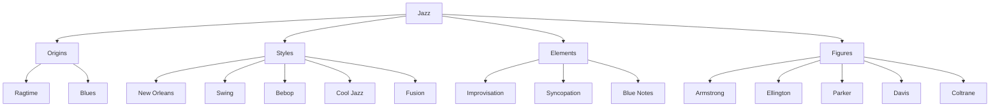

```mermaid
flowchart TD
    J[Jazz] --> O[Origins]
    J --> S[Styles]
    J --> E[Elements]
    J --> F[Figures]

    O --> R[Ragtime]
    O --> B[Blues]

    S --> NO[New Orleans]
    S --> S2[Swing]
    S --> B2[Bebop]
    S --> C[Cool Jazz]
    S --> F2[Fusion]

    E --> I[Improvisation]
    E --> S3[Syncopation]
    E --> B3[Blue Notes]

    F --> A[Armstrong]
    F --> E2[Ellington]
    F --> P[Parker]
    F --> D[Davis]
    F --> C2[Coltrane]
```
