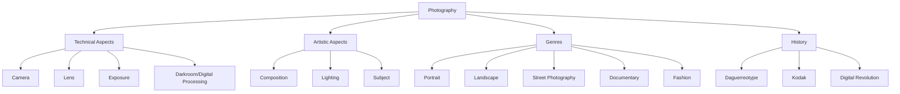

```mermaid
flowchart TD
    P[Photography] --> T[Technical Aspects]
    P --> A[Artistic Aspects]
    P --> G[Genres]
    P --> H[History]

    T --> C[Camera]
    T --> L[Lens]
    T --> E[Exposure]
    T --> DP[Darkroom/Digital Processing]

    A --> C2[Composition]
    A --> L2[Lighting]
    A --> S[Subject]

    G --> P2[Portrait]
    G --> L3[Landscape]
    G --> S2[Street Photography]
    G --> D[Documentary]
    G --> F[Fashion]

    H --> D2[Daguerreotype]
    H --> K[Kodak]
    H --> D3[Digital Revolution]
```
