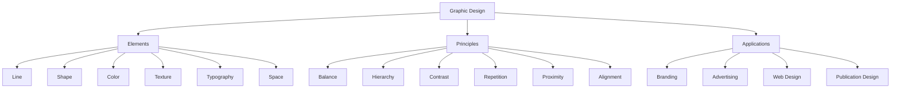

```mermaid
flowchart TD
    GD[Graphic Design] --> E[Elements]
    GD --> P[Principles]
    GD --> A[Applications]

    E --> L[Line]
    E --> S[Shape]
    E --> C[Color]
    E --> T[Texture]
    E --> T2[Typography]
    E --> S2[Space]

    P --> B[Balance]
    P --> H[Hierarchy]
    P --> C2[Contrast]
    P --> R[Repetition]
    P --> P2[Proximity]
    P --> A2[Alignment]

    A --> B2[Branding]
    A --> A3[Advertising]
    A --> W[Web Design]
    A --> P3[Publication Design]
```
