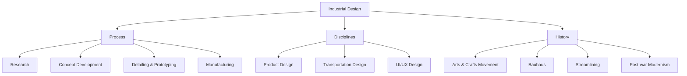

```mermaid
flowchart TD
    ID[Industrial Design] --> P[Process]
    ID --> D[Disciplines]
    ID --> H[History]

    P --> R[Research]
    P --> C[Concept Development]
    P --> D2[Detailing & Prototyping]
    P --> M[Manufacturing]

    D --> P2[Product Design]
    D --> T[Transportation Design]
    D --> U[UI/UX Design]

    H --> A[Arts & Crafts Movement]
    H --> B[Bauhaus]
    H --> S[Streamlining]
    H --> P3[Post-war Modernism]
```
