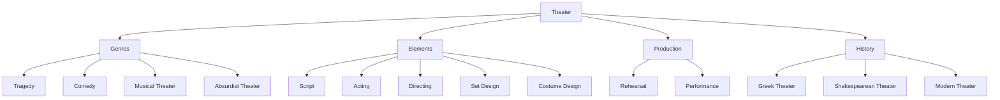

```mermaid
flowchart TD
    T[Theater] --> G[Genres]
    T --> E[Elements]
    T --> P[Production]
    T --> H[History]

    G --> T2[Tragedy]
    G --> C[Comedy]
    G --> M[Musical Theater]
    G --> A[Absurdist Theater]

    E --> S[Script]
    E --> A2[Acting]
    E --> D[Directing]
    E --> S2[Set Design]
    E --> C2[Costume Design]

    P --> R[Rehearsal]
    P --> P2[Performance]

    H --> G2[Greek Theater]
    H --> S3[Shakespearean Theater]
    H --> M2[Modern Theater]
```
