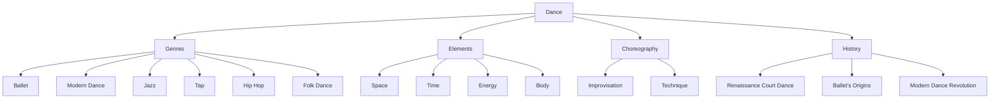

```mermaid
flowchart TD
    D[Dance] --> G[Genres]
    D --> E[Elements]
    D --> C[Choreography]
    D --> H[History]

    G --> B[Ballet]
    G --> M[Modern Dance]
    G --> J[Jazz]
    G --> T[Tap]
    G --> HH[Hip Hop]
    G --> F[Folk Dance]

    E --> S[Space]
    E --> T2[Time]
    E --> E2[Energy]
    E --> B2[Body]

    C --> I[Improvisation]
    C --> T3[Technique]

    H --> R[Renaissance Court Dance]
    H --> B3[Ballet's Origins]
    H --> M2[Modern Dance Revolution]
```
