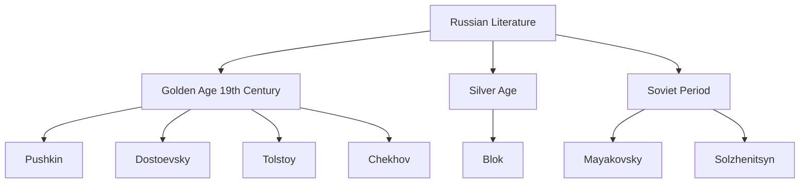

```mermaid
flowchart TD
    RussianLiterature[Russian Literature] --> GoldenAge[Golden Age 19th Century]
    RussianLiterature --> SilverAge[Silver Age]
    RussianLiterature --> Soviet[Soviet Period]
    GoldenAge --> Pushkin[Pushkin]
    GoldenAge --> Dostoevsky[Dostoevsky]
    GoldenAge --> Tolstoy[Tolstoy]
    GoldenAge --> Chekhov[Chekhov]
    SilverAge --> Blok[Blok]
    Soviet --> Mayakovsky[Mayakovsky]
    Soviet --> Solzhenitsyn[Solzhenitsyn]
```