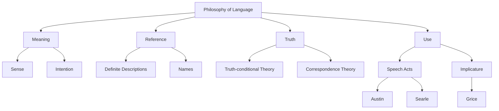

```mermaid
flowchart TD
    PL[Philosophy of Language] --> M[Meaning]
    PL --> R[Reference]
    PL --> T[Truth]
    PL --> U[Use]

    M --> S[Sense]
    M --> I[Intention]

    R --> D[Definite Descriptions]
    R --> N[Names]

    T --> T2[Truth-conditional Theory]
    T --> C[Correspondence Theory]

    U --> S2[Speech Acts]
    U --> I2[Implicature]

    S2 --> A[Austin]
    S2 --> S3[Searle]

    I2 --> G[Grice]
```
