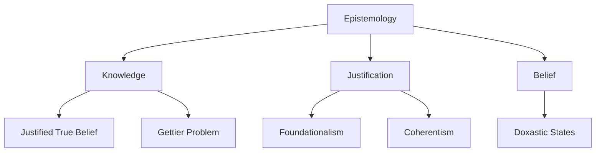

```mermaid
flowchart TD
    Epistemology[Epistemology] --> Knowledge[Knowledge]
    Epistemology --> Justification[Justification]
    Epistemology --> Belief[Belief]
    Knowledge --> JTB[Justified True Belief]
    Knowledge --> Gettier[Gettier Problem]
    Justification --> Foundationalism[Foundationalism]
    Justification --> Coherentism[Coherentism]
    Belief --> Doxastic[Doxastic States]
```