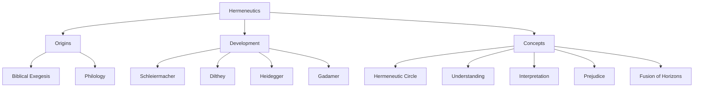

```mermaid
flowchart TD
    H[Hermeneutics] --> O[Origins]
    H --> D[Development]
    H --> C[Concepts]

    O --> B[Biblical Exegesis]
    O --> P[Philology]

    D --> S[Schleiermacher]
    D --> D2[Dilthey]
    D --> H2[Heidegger]
    D --> G[Gadamer]

    C --> HC[Hermeneutic Circle]
    C --> U[Understanding]
    C --> I[Interpretation]
    C --> P2[Prejudice]
    C --> F[Fusion of Horizons]
```
