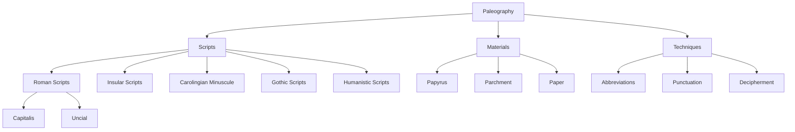

```mermaid
flowchart TD
    P[Paleography] --> S[Scripts]
    P --> M[Materials]
    P --> T[Techniques]

    S --> R[Roman Scripts]
    S --> I[Insular Scripts]
    S --> C[Carolingian Minuscule]
    S --> G[Gothic Scripts]
    S --> H[Humanistic Scripts]

    R --> C2[Capitalis]
    R --> U[Uncial]

    M --> P2[Papyrus]
    M --> P3[Parchment]
    M --> P4[Paper]

    T --> A[Abbreviations]
    T --> P5[Punctuation]
    T --> D[Decipherment]
```
