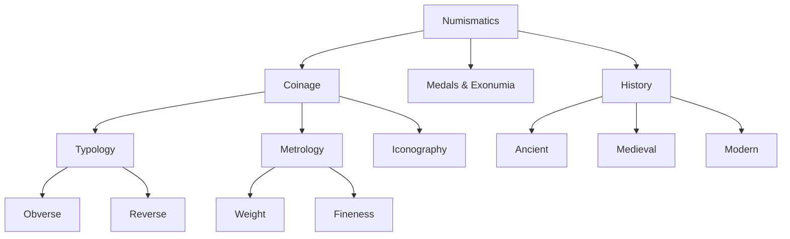

```mermaid
flowchart TD
    N[Numismatics] --> C[Coinage]
    N --> M[Medals & Exonumia]
    N --> H[History]

    C --> T[Typology]
    C --> M2[Metrology]
    C --> I[Iconography]

    T --> O[Obverse]
    T --> R[Reverse]

    M2 --> W[Weight]
    M2 --> F[Fineness]

    H --> A[Ancient]
    H --> M3[Medieval]
    H --> M4[Modern]
```
