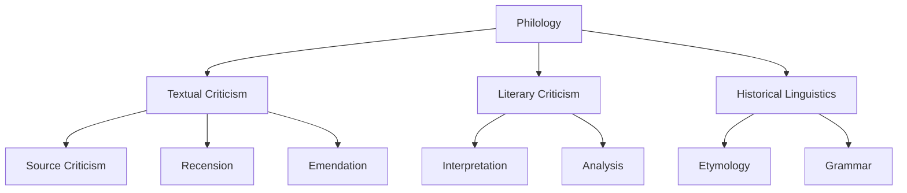

```mermaid
flowchart TD
    P[Philology] --> T[Textual Criticism]
    P --> L[Literary Criticism]
    P --> H[Historical Linguistics]

    T --> S[Source Criticism]
    T --> R[Recension]
    T --> E[Emendation]

    L --> I[Interpretation]
    L --> A[Analysis]

    H --> E2[Etymology]
    H --> G[Grammar]
```
