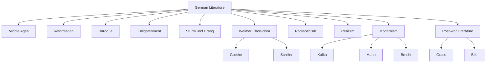

```mermaid
flowchart TD
    GL[German Literature] --> M[Middle Ages]
    GL --> R[Reformation]
    GL --> B[Baroque]
    GL --> E[Enlightenment]
    GL --> SC[Sturm und Drang]
    GL --> W[Weimar Classicism]
    GL --> R2[Romanticism]
    GL --> R3[Realism]
    GL --> M2[Modernism]
    GL --> P[Post-war Literature]

    W --> G[Goethe]
    W --> S[Schiller]

    M2 --> K[Kafka]
    M2 --> M3[Mann]
    M2 --> B2[Brecht]

    P --> G2[Grass]
    P --> B3[Böll]
```
