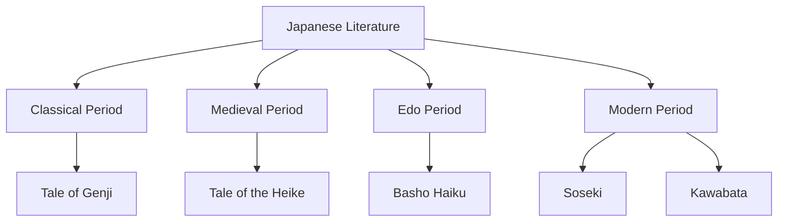

```mermaid
flowchart TD
    JapaneseLiterature[Japanese Literature] --> Classical[Classical Period]
    JapaneseLiterature --> Medieval[Medieval Period]
    JapaneseLiterature --> Edo[Edo Period]
    JapaneseLiterature --> Modern[Modern Period]
    Classical --> Genji[Tale of Genji]
    Medieval --> Heike[Tale of the Heike]
    Edo --> Basho[Basho Haiku]
    Modern --> Soseki[Soseki]
    Modern --> Kawabata[Kawabata]
```