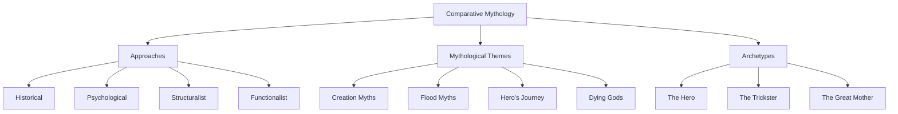

```mermaid
flowchart TD
    CM[Comparative Mythology] --> A[Approaches]
    CM --> M[Mythological Themes]
    CM --> A2[Archetypes]

    A --> H[Historical]
    A --> P[Psychological]
    A --> S[Structuralist]
    A --> F[Functionalist]

    M --> C[Creation Myths]
    M --> F2[Flood Myths]
    M --> H2[Hero's Journey]
    M --> D[Dying Gods]

    A2 --> H3[The Hero]
    A2 --> T[The Trickster]
    A2 --> GM[The Great Mother]
```
