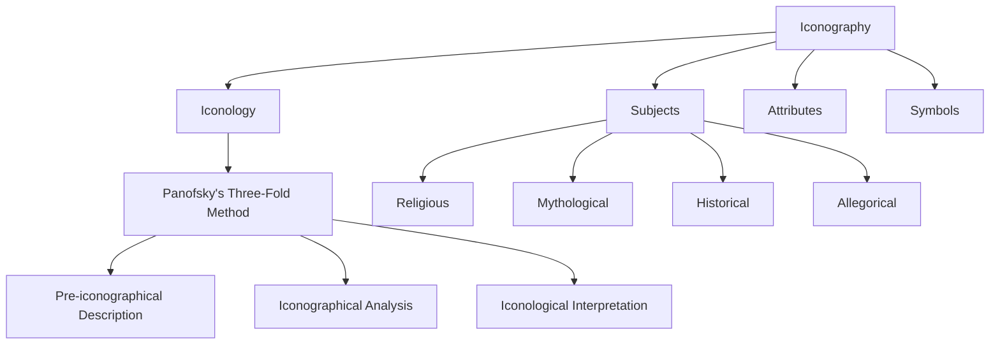

```mermaid
flowchart TD
    I[Iconography] --> I2[Iconology]
    I --> S[Subjects]
    I --> A[Attributes]
    I --> S2[Symbols]

    I2 --> P[Panofsky's Three-Fold Method]
    P --> P2[Pre-iconographical Description]
    P --> I3[Iconographical Analysis]
    P --> I4[Iconological Interpretation]

    S --> R[Religious]
    S --> M[Mythological]
    S --> H[Historical]
    S --> A2[Allegorical]
```
