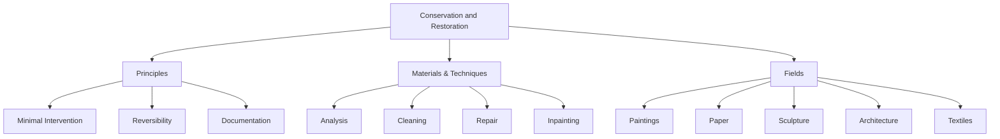

```mermaid
flowchart TD
    CR[Conservation and Restoration] --> P[Principles]
    CR --> M[Materials & Techniques]
    CR --> F[Fields]

    P --> M2[Minimal Intervention]
    P --> R[Reversibility]
    P --> D[Documentation]

    M --> A[Analysis]
    M --> C[Cleaning]
    M --> R2[Repair]
    M --> I[Inpainting]

    F --> P2[Paintings]
    F --> P3[Paper]
    F --> S[Sculpture]
    F --> A2[Architecture]
    F --> T[Textiles]
```
