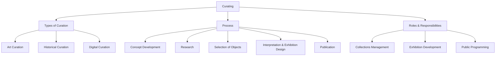

```mermaid
flowchart TD
    C[Curating] --> T[Types of Curation]
    C --> P[Process]
    C --> R[Roles & Responsibilities]

    T --> A[Art Curation]
    T --> H[Historical Curation]
    T --> D[Digital Curation]

    P --> C2[Concept Development]
    P --> R2[Research]
    P --> S[Selection of Objects]
    P --> I[Interpretation & Exhibition Design]
    P --> P2[Publication]

    R --> C3[Collections Management]
    R --> E[Exhibition Development]
    R --> P3[Public Programming]
```
