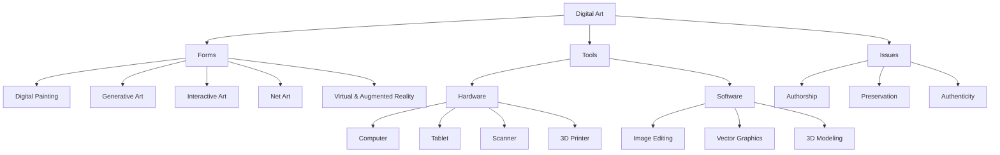

```mermaid
flowchart TD
    DA[Digital Art] --> F[Forms]
    DA --> T[Tools]
    DA --> I[Issues]

    F --> D2[Digital Painting]
    F --> G[Generative Art]
    F --> I2[Interactive Art]
    F --> N[Net Art]
    F --> VR[Virtual & Augmented Reality]

    T --> H[Hardware]
    T --> S[Software]

    H --> C[Computer]
    H --> T2[Tablet]
    H --> S2[Scanner]
    H --> P[3D Printer]

    S --> I3[Image Editing]
    S --> V[Vector Graphics]
    S --> M[3D Modeling]

    I --> A[Authorship]
    I --> P2[Preservation]
    I --> A2[Authenticity]
```
