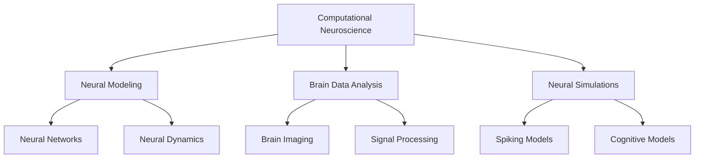

```mermaid
flowchart TD
    ComputationalNeuroscience[Computational Neuroscience] --> Modeling[Neural Modeling]
    ComputationalNeuroscience --> Analysis[Brain Data Analysis]
    ComputationalNeuroscience --> Simulation[Neural Simulations]
    Modeling --> Networks[Neural Networks]
    Modeling --> Dynamics[Neural Dynamics]
    Analysis --> Imaging[Brain Imaging]
    Analysis --> Signals[Signal Processing]
    Simulation --> Spiking[Spiking Models]
    Simulation --> Cognitive[Cognitive Models]
```