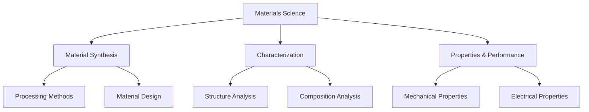

```mermaid
flowchart TD
    MaterialsScience[Materials Science] --> Synthesis[Material Synthesis]
    MaterialsScience --> Characterization[Characterization]
    MaterialsScience --> Properties[Properties & Performance]
    Synthesis --> Processing[Processing Methods]
    Synthesis --> Design[Material Design]
    Characterization --> Structure[Structure Analysis]
    Characterization --> Composition[Composition Analysis]
    Properties --> Mechanical[Mechanical Properties]
    Properties --> Electrical[Electrical Properties]
```