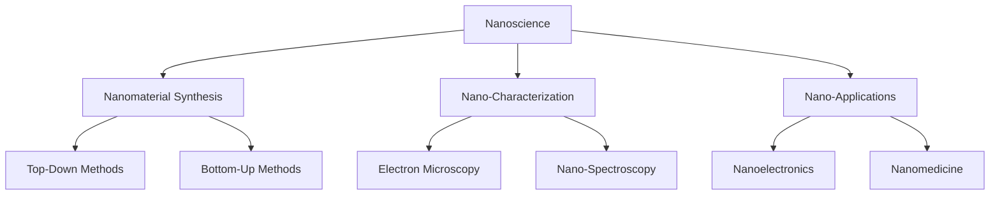

```mermaid
flowchart TD
    Nanoscience[Nanoscience] --> Synthesis[Nanomaterial Synthesis]
    Nanoscience --> Characterization[Nano-Characterization]
    Nanoscience --> Applications[Nano-Applications]
    Synthesis --> TopDown[Top-Down Methods]
    Synthesis --> BottomUp[Bottom-Up Methods]
    Characterization --> Microscopy[Electron Microscopy]
    Characterization --> Spectroscopy[Nano-Spectroscopy]
    Applications --> Electronics[Nanoelectronics]
    Applications --> Medicine[Nanomedicine]
```