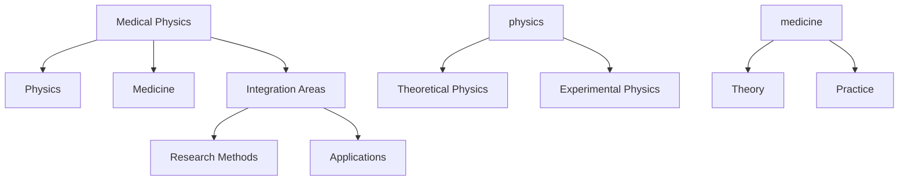

```mermaid
flowchart TD
    MedicalPhysics[Medical Physics] --> Field1[Physics]
    MedicalPhysics --> Field2[Medicine]
    MedicalPhysics --> Integration[Integration Areas]
    physics --> physicsSub1[Theoretical Physics]
    physics --> physicsSub2[Experimental Physics]
    medicine --> medicineSub1[Theory]
    medicine --> medicineSub2[Practice]
    Integration --> Methods[Research Methods]
    Integration --> Applications[Applications]
```