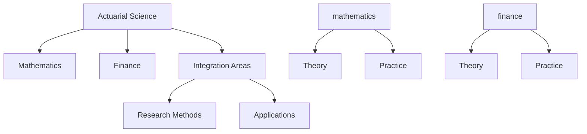

```mermaid
flowchart TD
    ActuarialScience[Actuarial Science] --> Field1[Mathematics]
    ActuarialScience --> Field2[Finance]
    ActuarialScience --> Integration[Integration Areas]
    mathematics --> mathematicsSub1[Theory]
    mathematics --> mathematicsSub2[Practice]
    finance --> financeSub1[Theory]
    finance --> financeSub2[Practice]
    Integration --> Methods[Research Methods]
    Integration --> Applications[Applications]
```