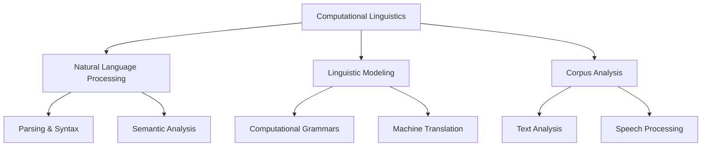

```mermaid
flowchart TD
    ComputationalLinguistics[Computational Linguistics] --> NLP[Natural Language Processing]
    ComputationalLinguistics --> Modeling[Linguistic Modeling]
    ComputationalLinguistics --> Analysis[Corpus Analysis]
    NLP --> Parsing[Parsing & Syntax]
    NLP --> Semantics[Semantic Analysis]
    Modeling --> Grammars[Computational Grammars]
    Modeling --> Machine[Machine Translation]
    Analysis --> Text[Text Analysis]
    Analysis --> Speech[Speech Processing]
```