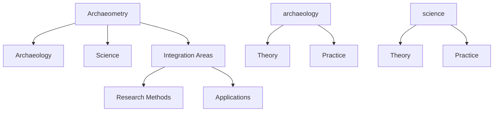

```mermaid
flowchart TD
    Archaeometry[Archaeometry] --> Field1[Archaeology]
    Archaeometry --> Field2[Science]
    Archaeometry --> Integration[Integration Areas]
    archaeology --> archaeologySub1[Theory]
    archaeology --> archaeologySub2[Practice]
    science --> scienceSub1[Theory]
    science --> scienceSub2[Practice]
    Integration --> Methods[Research Methods]
    Integration --> Applications[Applications]
```