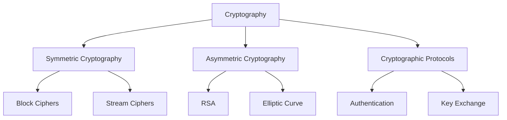

```mermaid
flowchart TD
    Cryptography[Cryptography] --> Symmetric[Symmetric Cryptography]
    Cryptography --> Asymmetric[Asymmetric Cryptography]
    Cryptography --> Protocols[Cryptographic Protocols]
    Symmetric --> Block[Block Ciphers]
    Symmetric --> Stream[Stream Ciphers]
    Asymmetric --> RSA[RSA]
    Asymmetric --> Elliptic[Elliptic Curve]
    Protocols --> Authentication[Authentication]
    Protocols --> KeyExchange[Key Exchange]
```