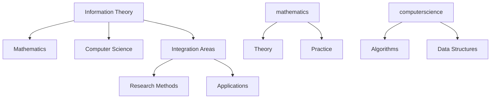

```mermaid
flowchart TD
    InformationTheory[Information Theory] --> Field1[Mathematics]
    InformationTheory --> Field2[Computer Science]
    InformationTheory --> Integration[Integration Areas]
    mathematics --> mathematicsSub1[Theory]
    mathematics --> mathematicsSub2[Practice]
    computerscience --> computerscienceSub1[Algorithms]
    computerscience --> computerscienceSub2[Data Structures]
    Integration --> Methods[Research Methods]
    Integration --> Applications[Applications]
```