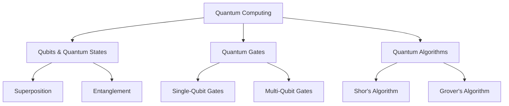

```mermaid
flowchart TD
    QuantumComputing[Quantum Computing] --> Qubits[Qubits & Quantum States]
    QuantumComputing --> Gates[Quantum Gates]
    QuantumComputing --> Algorithms[Quantum Algorithms]
    Qubits --> Superposition[Superposition]
    Qubits --> Entanglement[Entanglement]
    Gates --> Single[Single-Qubit Gates]
    Gates --> Multi[Multi-Qubit Gates]
    Algorithms --> Shor[Shor's Algorithm]
    Algorithms --> Grover[Grover's Algorithm]
```