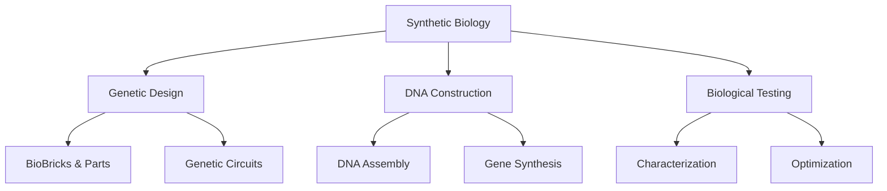

```mermaid
flowchart TD
    SyntheticBiology[Synthetic Biology] --> Design[Genetic Design]
    SyntheticBiology --> Construction[DNA Construction]
    SyntheticBiology --> Testing[Biological Testing]
    Design --> Parts[BioBricks & Parts]
    Design --> Circuits[Genetic Circuits]
    Construction --> Assembly[DNA Assembly]
    Construction --> Synthesis[Gene Synthesis]
    Testing --> Characterization[Characterization]
    Testing --> Optimization[Optimization]
```