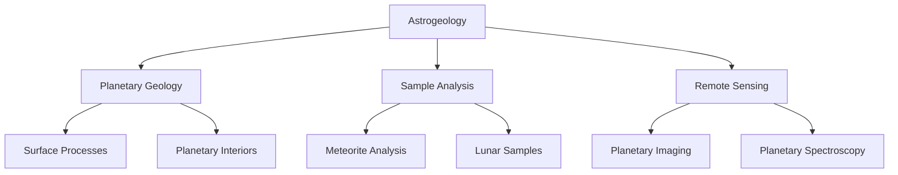

```mermaid
flowchart TD
    Astrogeology[Astrogeology] --> Planetary[Planetary Geology]
    Astrogeology --> Analysis[Sample Analysis]
    Astrogeology --> Remote[Remote Sensing]
    Planetary --> Surfaces[Surface Processes]
    Planetary --> Interiors[Planetary Interiors]
    Analysis --> Meteorites[Meteorite Analysis]
    Analysis --> MoonRocks[Lunar Samples]
    Remote --> Imaging[Planetary Imaging]
    Remote --> Spectroscopy[Planetary Spectroscopy]
```