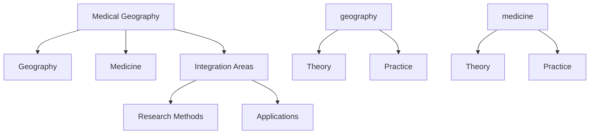

```mermaid
flowchart TD
    MedicalGeography[Medical Geography] --> Field1[Geography]
    MedicalGeography --> Field2[Medicine]
    MedicalGeography --> Integration[Integration Areas]
    geography --> geographySub1[Theory]
    geography --> geographySub2[Practice]
    medicine --> medicineSub1[Theory]
    medicine --> medicineSub2[Practice]
    Integration --> Methods[Research Methods]
    Integration --> Applications[Applications]
```