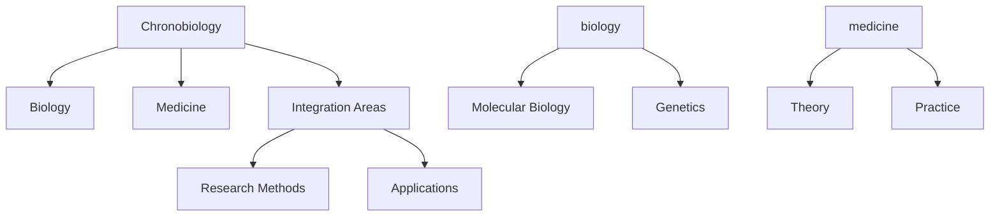

```mermaid
flowchart TD
    Chronobiology[Chronobiology] --> Field1[Biology]
    Chronobiology --> Field2[Medicine]
    Chronobiology --> Integration[Integration Areas]
    biology --> biologySub1[Molecular Biology]
    biology --> biologySub2[Genetics]
    medicine --> medicineSub1[Theory]
    medicine --> medicineSub2[Practice]
    Integration --> Methods[Research Methods]
    Integration --> Applications[Applications]
```