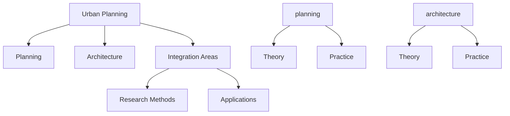

```mermaid
flowchart TD
    UrbanPlanning[Urban Planning] --> Field1[Planning]
    UrbanPlanning --> Field2[Architecture]
    UrbanPlanning --> Integration[Integration Areas]
    planning --> planningSub1[Theory]
    planning --> planningSub2[Practice]
    architecture --> architectureSub1[Theory]
    architecture --> architectureSub2[Practice]
    Integration --> Methods[Research Methods]
    Integration --> Applications[Applications]
```