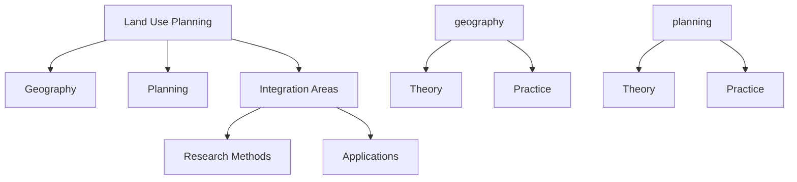

```mermaid
flowchart TD
    LandUsePlanning[Land Use Planning] --> Field1[Geography]
    LandUsePlanning --> Field2[Planning]
    LandUsePlanning --> Integration[Integration Areas]
    geography --> geographySub1[Theory]
    geography --> geographySub2[Practice]
    planning --> planningSub1[Theory]
    planning --> planningSub2[Practice]
    Integration --> Methods[Research Methods]
    Integration --> Applications[Applications]
```