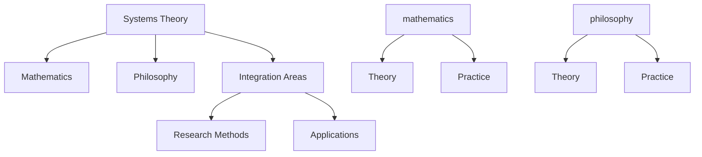

```mermaid
flowchart TD
    SystemsTheory[Systems Theory] --> Field1[Mathematics]
    SystemsTheory --> Field2[Philosophy]
    SystemsTheory --> Integration[Integration Areas]
    mathematics --> mathematicsSub1[Theory]
    mathematics --> mathematicsSub2[Practice]
    philosophy --> philosophySub1[Theory]
    philosophy --> philosophySub2[Practice]
    Integration --> Methods[Research Methods]
    Integration --> Applications[Applications]
```