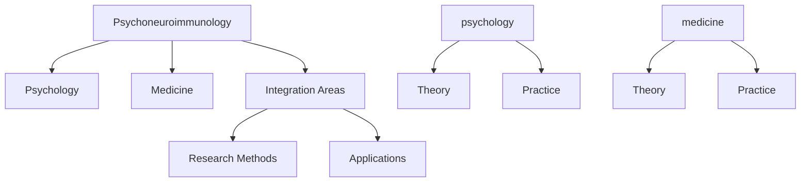

```mermaid
flowchart TD
    Psychoneuroimmunology[Psychoneuroimmunology] --> Field1[Psychology]
    Psychoneuroimmunology --> Field2[Medicine]
    Psychoneuroimmunology --> Integration[Integration Areas]
    psychology --> psychologySub1[Theory]
    psychology --> psychologySub2[Practice]
    medicine --> medicineSub1[Theory]
    medicine --> medicineSub2[Practice]
    Integration --> Methods[Research Methods]
    Integration --> Applications[Applications]
```