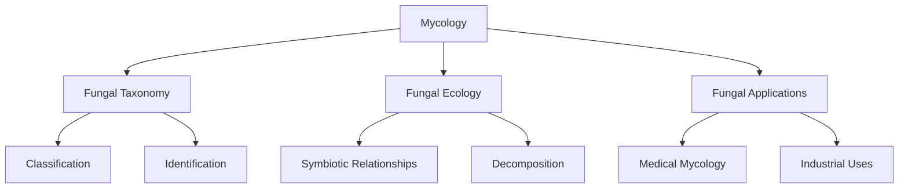

```mermaid
flowchart TD
    Mycology[Mycology] --> Taxonomy[Fungal Taxonomy]
    Mycology --> Ecology[Fungal Ecology]
    Mycology --> Applications[Fungal Applications]
    Taxonomy --> Classification[Classification]
    Taxonomy --> Identification[Identification]
    Ecology --> Symbiosis[Symbiotic Relationships]
    Ecology --> Decomposition[Decomposition]
    Applications --> Medicine[Medical Mycology]
    Applications --> Industry[Industrial Uses]
```