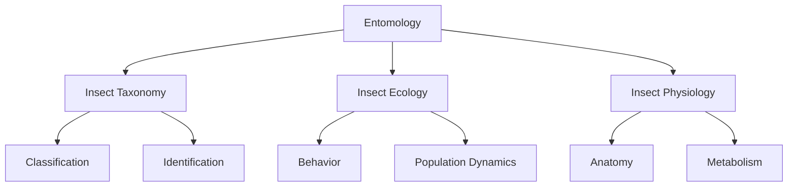

```mermaid
flowchart TD
    Entomology[Entomology] --> Taxonomy[Insect Taxonomy]
    Entomology --> Ecology[Insect Ecology]
    Entomology --> Physiology[Insect Physiology]
    Taxonomy --> Classification[Classification]
    Taxonomy --> Identification[Identification]
    Ecology --> Behavior[Behavior]
    Ecology --> Populations[Population Dynamics]
    Physiology --> Anatomy[Anatomy]
    Physiology --> Metabolism[Metabolism]
```