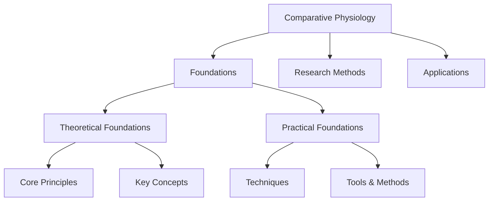

```mermaid
flowchart TD
    ComparativePhysiology[Comparative Physiology] --> Foundations[Foundations]
    ComparativePhysiology --> Methods[Research Methods]
    ComparativePhysiology --> Applications[Applications]
    Foundations --> Theory[Theoretical Foundations]
    Foundations --> Practice[Practical Foundations]
    Theory --> Principles[Core Principles]
    Theory --> Concepts[Key Concepts]
    Practice --> Techniques[Techniques]
    Practice --> Tools[Tools & Methods]
```