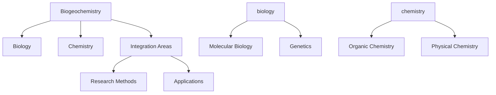

```mermaid
flowchart TD
    Biogeochemistry[Biogeochemistry] --> Field1[Biology]
    Biogeochemistry --> Field2[Chemistry]
    Biogeochemistry --> Integration[Integration Areas]
    biology --> biologySub1[Molecular Biology]
    biology --> biologySub2[Genetics]
    chemistry --> chemistrySub1[Organic Chemistry]
    chemistry --> chemistrySub2[Physical Chemistry]
    Integration --> Methods[Research Methods]
    Integration --> Applications[Applications]
```