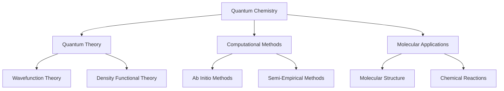

```mermaid
flowchart TD
    QuantumChemistry[Quantum Chemistry] --> Theory[Quantum Theory]
    QuantumChemistry --> Methods[Computational Methods]
    QuantumChemistry --> Applications[Molecular Applications]
    Theory --> Wavefunction[Wavefunction Theory]
    Theory --> Density[Density Functional Theory]
    Methods --> AbInitio[Ab Initio Methods]
    Methods --> Semi[Semi-Empirical Methods]
    Applications --> Structure[Molecular Structure]
    Applications --> Reactions[Chemical Reactions]
```