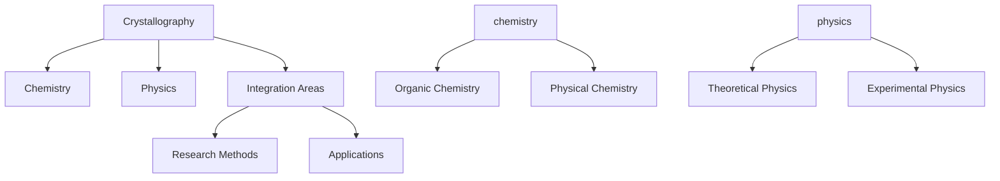

```mermaid
flowchart TD
    Crystallography[Crystallography] --> Field1[Chemistry]
    Crystallography --> Field2[Physics]
    Crystallography --> Integration[Integration Areas]
    chemistry --> chemistrySub1[Organic Chemistry]
    chemistry --> chemistrySub2[Physical Chemistry]
    physics --> physicsSub1[Theoretical Physics]
    physics --> physicsSub2[Experimental Physics]
    Integration --> Methods[Research Methods]
    Integration --> Applications[Applications]
```