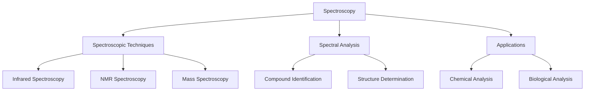

```mermaid
flowchart TD
    Spectroscopy[Spectroscopy] --> Techniques[Spectroscopic Techniques]
    Spectroscopy --> Analysis[Spectral Analysis]
    Spectroscopy --> Applications[Applications]
    Techniques --> IR[Infrared Spectroscopy]
    Techniques --> NMR[NMR Spectroscopy]
    Techniques --> Mass[Mass Spectroscopy]
    Analysis --> Identification[Compound Identification]
    Analysis --> Structure[Structure Determination]
    Applications --> Chemistry[Chemical Analysis]
    Applications --> Biology[Biological Analysis]
```