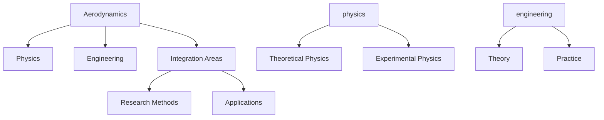

```mermaid
flowchart TD
    Aerodynamics[Aerodynamics] --> Field1[Physics]
    Aerodynamics --> Field2[Engineering]
    Aerodynamics --> Integration[Integration Areas]
    physics --> physicsSub1[Theoretical Physics]
    physics --> physicsSub2[Experimental Physics]
    engineering --> engineeringSub1[Theory]
    engineering --> engineeringSub2[Practice]
    Integration --> Methods[Research Methods]
    Integration --> Applications[Applications]
```