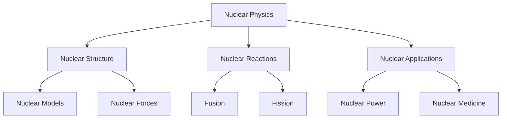

```mermaid
flowchart TD
    NuclearPhysics[Nuclear Physics] --> Structure[Nuclear Structure]
    NuclearPhysics --> Reactions[Nuclear Reactions]
    NuclearPhysics --> Applications[Nuclear Applications]
    Structure --> Models[Nuclear Models]
    Structure --> Forces[Nuclear Forces]
    Reactions --> Fusion[Fusion]
    Reactions --> Fission[Fission]
    Applications --> Power[Nuclear Power]
    Applications --> Medicine[Nuclear Medicine]
```