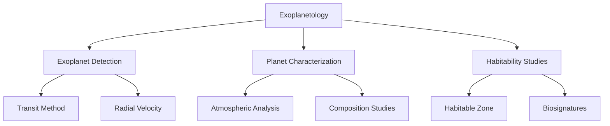

```mermaid
flowchart TD
    Exoplanetology[Exoplanetology] --> Detection[Exoplanet Detection]
    Exoplanetology --> Characterization[Planet Characterization]
    Exoplanetology --> Habitability[Habitability Studies]
    Detection --> Transit[Transit Method]
    Detection --> Radial[Radial Velocity]
    Characterization --> Atmosphere[Atmospheric Analysis]
    Characterization --> Composition[Composition Studies]
    Habitability --> Zone[Habitable Zone]
    Habitability --> Biosignatures[Biosignatures]
```