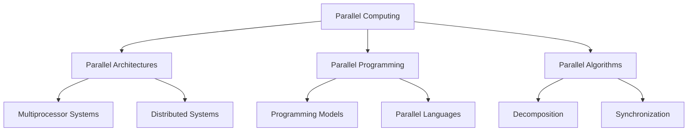

```mermaid
flowchart TD
    ParallelComputing[Parallel Computing] --> Architectures[Parallel Architectures]
    ParallelComputing --> Programming[Parallel Programming]
    ParallelComputing --> Algorithms[Parallel Algorithms]
    Architectures --> Multiprocessor[Multiprocessor Systems]
    Architectures --> Distributed[Distributed Systems]
    Programming --> Models[Programming Models]
    Programming --> Languages[Parallel Languages]
    Algorithms --> Decomposition[Decomposition]
    Algorithms --> Synchronization[Synchronization]
```