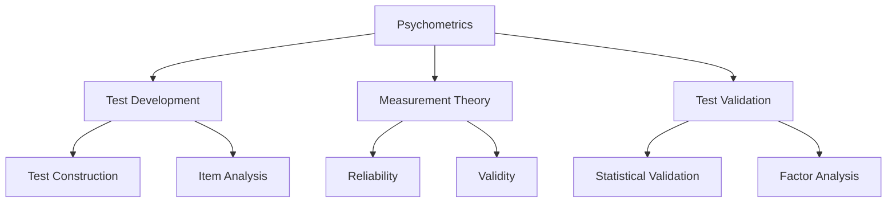

```mermaid
flowchart TD
    Psychometrics[Psychometrics] --> Test[Test Development]
    Psychometrics --> Measurement[Measurement Theory]
    Psychometrics --> Validation[Test Validation]
    Test --> Construction[Test Construction]
    Test --> Items[Item Analysis]
    Measurement --> Reliability[Reliability]
    Measurement --> Validity[Validity]
    Validation --> Statistical[Statistical Validation]
    Validation --> Factor[Factor Analysis]
```